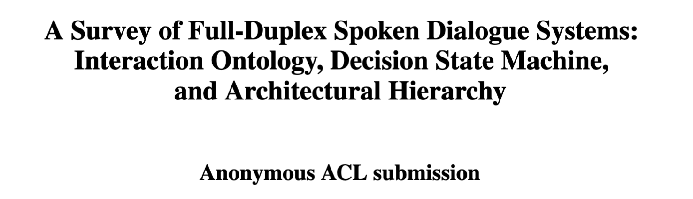
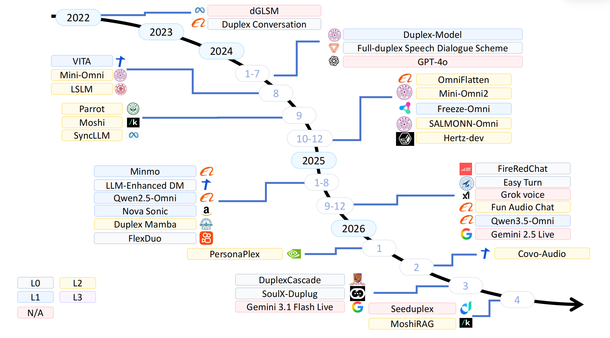
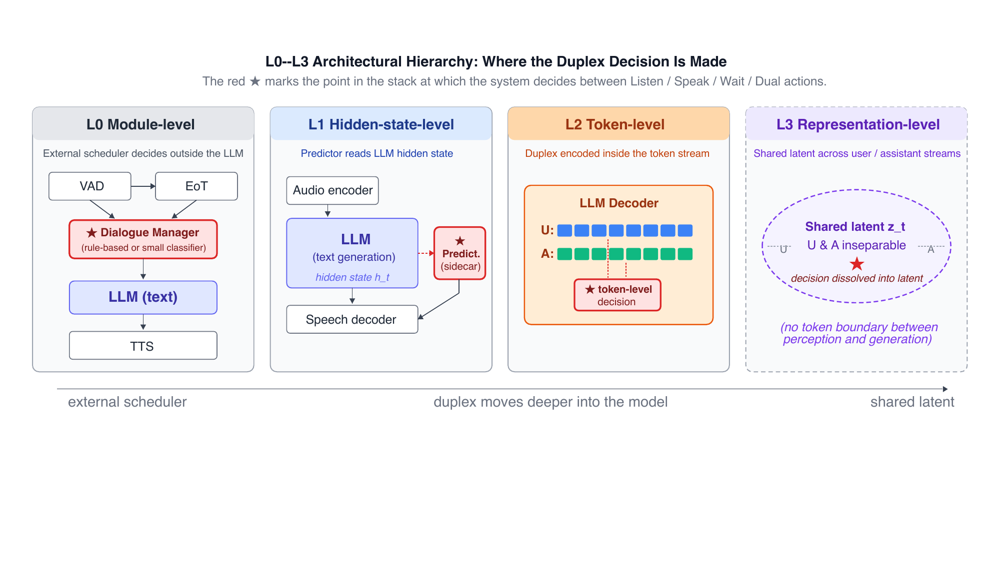
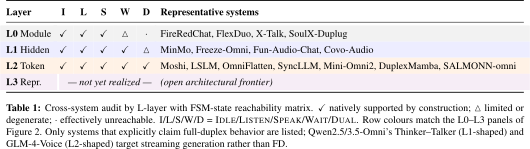
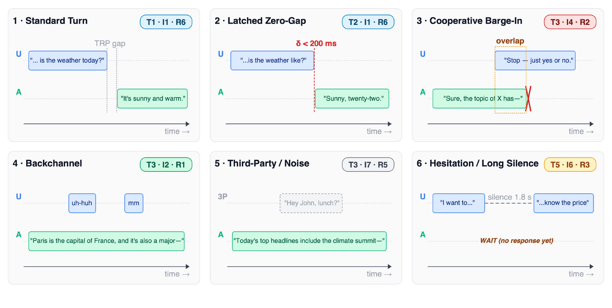
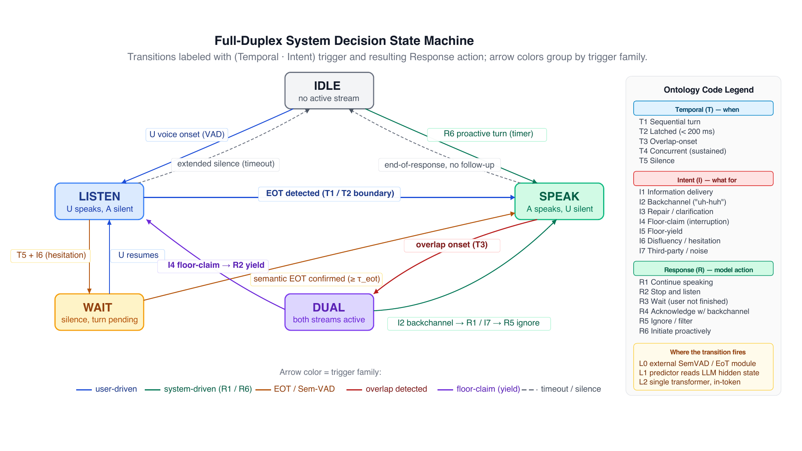

<div align='center'>

</div>

# 🚀 Quick Start

This repository accompanies **A Survey of Full-Duplex Spoken Dialogue Systems: Interaction Ontology, Decision State Machine, and Architectural Hierarchy**.

- [Introduction](#introduction)
- [A Brief History of Full-Duplex Spoken Dialogue Systems](#a-brief-history-of-full-duplex-spoken-dialogue-systems)
- [Architectural Hierarchy and Cross-System Audit](#architectural-hierarchy-and-cross-system-audit)
- [The T × I × R Interaction Ontology](#the-t--i--r-interaction-ontology)
- [The Full-Duplex Decision State Machine](#the-full-duplex-decision-state-machine)
- [Frontiers and Conclusion](#frontiers-and-conclusion)
- [Appendix: Public Resources](#appendix-public-resources)
    - [Publicly Available Full-Duplex Models](#publicly-available-full-duplex-models)
    - [Full-Duplex Datasets](#full-duplex-datasets)
    - [Full-Duplex Benchmarks](#full-duplex-benchmarks)
- [Cite](#cite)

# 🔥What's new

## Introduction

This repository is the official repository of **A Survey of Full-Duplex Spoken Dialogue Systems: Interaction Ontology, Decision State Machine, and Architectural Hierarchy** [[Paper page](./asset/Beyond_Turn_Taking.pdf)] [[Demo](https://duplexlm.github.io/DuplexLM/demo.html)].

> Abstract
>
> Since the demonstration of GPT-4o in May 2024, over a dozen "full-duplex" spoken dialogue systems have emerged, yet each author has a distinct understanding of these systems. Existing surveys collapse them onto a single axis (cascaded/end-to-end, or engineered/learned) and miss the distinctions that matter most for builders. We argue the field's confusion is not architectural but *taxonomical*, and offer three frameworks that together make full-duplex analytically tractable: **(i)** an **L0-L3 Architectural Hierarchy** locating where in the model stack the duplex decision is made (external module, hidden state, token sequence, or shared latent); **(ii)** a **T x I x R Interaction Ontology** that names every interaction a full-duplex system might face along temporal, intent, and response axes; and **(iii)** a **Decision State Machine** (Idle/Listen/Speak/Wait/Dual) that turns "what is the system doing right now" into a shared vocabulary. Across published systems and benchmarks we audit the field through these three lenses and surface two open frontiers —— the open-source-versus-industrial data gap and the still-unrealized L3 representation-level layer —— as the highest-leverage targets for next-generation data construction and full-duplex model design.
> The related material is available at [this https url](https://duplexlm.github.io/DuplexLM/demo.html).

## A Brief History of Full-Duplex Spoken Dialogue Systems

Full-duplex spoken dialogue systems moved from modular pre-LLM pipelines, to speech-token LLMs, to GPT-4o-style live interaction. After LSLM and Moshi, systems quickly split across L0 modular control, L1 hidden-state prediction, L2 token-level synchronization, and still-unrealized L3 representation-level design.

<div align='center'>


Figure 1: Timeline of published full-duplex spoken dialogue systems, 2021-2026, grouped by the L0-L3 architectural layer defined below.
</div>

## Architectural Hierarchy and Cross-System Audit

The L0--L3 hierarchy asks **where** duplex decisions happen: external module, hidden state, token sequence, or shared latent.

<div align='center'>


Figure 2: The L0-L3 architectural hierarchy. The decision migrates from an external scheduler (L0), to a sidecar predictor reading LLM hidden states (L1), to the token stream itself (L2), and finally to a hypothetical shared latent representation (L3, not yet realized).
</div>

Key claims: **L0 remains competitive rather than obsolete**; **L1 is a broad architectural attractor**; **L2 is the most populous and fully state-reachable but heterogeneous**; **L3 remains open**.

<div align='center'>

</div>

Architecture gives reachability; data decides behavior. Two L2 systems may both reach **Dual**, yet diverge on T3-I2-R1 backchanneling.

## The T × I × R Interaction Ontology

T × I × R asks **which** interaction the system faces: temporal relation, user intent, and required system response.

<div align='center'>

</div>

Six acid-test cells cover main full-duplex failure modes:

<div align='center'>

</div>

<div align='center'>


Figure 3: Six canonical full-duplex interaction scenarios. Each panel concretizes one (T, I, R) ontology cell on User (U) / Assistant (A) audio timelines.
</div>

Same cells serve as **data slices**, **benchmark criteria**, and **ablation targets**. "Fails on T3-I2-R1" is more useful than "not always full-duplex."

## The Full-Duplex Decision State Machine

Decision state machine asks **what the system is doing now**: Idle, Listen, Speak, Wait, or Dual.

<div align='center'>

</div>

Eleven transitions group into onset, turn-handoff, and overlap transitions. Overlap is key: destination depends on whether user audio is backchannel, floor claim, third-party speech, or other intent.

<div align='center'>


Figure 4: The full-duplex decision state machine: five states and eleven transitions. Each transition is labelled by its (T, I) trigger and the resulting R action.
</div>

TIR cells map directly to transitions: T3-I4-R2 → Speak → Dual → Listen; T3-I2-R1 and T3-I7-R5 → Speak → Dual → Speak; T5-I6-R3 → Listen → Wait → Listen.

## Frontiers and Conclusion

Two frontiers: **data coverage** and **L3 architecture**. Public data still under-covers T4 concurrent speech and I7 third-party speech; L3 remains unrealized.

Together, T × I × R, the five-state FSM, and L0-L3 replace "is this full-duplex?" with a structured profile: cells covered, states reached, implementation layer.

## Appendix: Public Resources

Public full-duplex resources, organized by TIR coverage.

### Publicly Available Full-Duplex Models

TBD.

### Full-Duplex Datasets

| Name | TIR coverage | Scale | URL |
|---|---|---:|---|
| Fisher English Training Speech | T1 Sequential / T3 Overlap; I2 Backchannel / I4 Floor-claim / I6 Disfluency; R1 Continue / R2 Stop / R4 Backchannel | ~1,960 h | [LDC Part 1](https://catalog.ldc.upenn.edu/LDC2004S13); [LDC Part 2](https://catalog.ldc.upenn.edu/LDC2005S13) |
| Switchboard-1 Release 2 | T1 Sequential / T3 Overlap / T5 Silence; I2 Backchannel / I3 Repair / I4 Floor-claim / I6 Disfluency; R3 Wait / R4 Backchannel | ~260 h | [LDC97S62](https://catalog.ldc.upenn.edu/LDC97S62) |
| CALLHOME American English Speech | T1 Sequential / T3 Overlap; I4 Floor-claim / I6 Disfluency / I7 Third-party | 120 calls / up to 30 min each | [LDC97S42](https://catalog.ldc.upenn.edu/LDC97S42) |
| HCRC Map Task Corpus | T1 Sequential / T2 Latched / T3 Overlap / T5 Silence; I3 Repair / I5 Floor-yield / I6 Disfluency; R4 Backchannel | 128 dialogues / ~18 h | [Official downloads](https://groups.inf.ed.ac.uk/maptask/maptasknxt.html) |
| Chiba University Japanese Map Task Dialogue Corpus | T1 Sequential / T2 Latched / T3 Overlap / T5 Silence; I2 Backchannel / I3 Repair / I6 Disfluency | 128 dialogues / ~23 h | [NII-SRC](https://research.nii.ac.jp/src/en/MapTask.html) |
| IFA Dialog Video Corpus (IFADV) | T3 Overlap; I2 Backchannel | 20 dialogues / ~5 h | [Official page](https://www.fon.hum.uva.nl/IFA-SpokenLanguageCorpora/IFADVcorpus/) |
| CANDOR Corpus | T1 Sequential / T3 Overlap; I2 Backchannel / I4 Floor-claim | 1,656 conversations / 850+ h | [TalkBank](https://talkbank.org/ca/access/CANDOR.html) |
| Multi-stream Spontaneous Conversation Training Datasets Chinese | T1 Sequential / T3 Overlap; I2 Backchannel / I4 Floor-claim | 27 conversations / ~10 h | [MagicHub](https://magichub.com/datasets/multi-stream-spontaneous-conversation-training-datasets_chinese/) |
| Multi-stream Spontaneous Conversation Training Datasets English | T1 Sequential / T3 Overlap; I2 Backchannel / I4 Floor-claim | 8 conversations / 5 h | [MagicHub](https://magichub.com/datasets/multi-stream-spontaneous-conversation-training-datasets_english/) |
| otoSpeech-full-duplex-280h | T1 Sequential / T3 Overlap; I4 Floor-claim | ~280 h | [Hugging Face](https://huggingface.co/datasets/otoearth/otoSpeech-full-duplex-280h) |
| otoSpeech-full-duplex-processed-141h | T1 Sequential / T3 Overlap; I4 Floor-claim | 141 h | [Hugging Face](https://huggingface.co/datasets/otoearth/otoSpeech-full-duplex-processed-141h) |
| Japanese CALLHOME | T1 Sequential / T3 Overlap / T5 Silence; I2 Backchannel / I6 Disfluency; R4 Backchannel | ~49 h full corpus; J-Moshi uses 16 h | [LDC96S37](https://catalog.ldc.upenn.edu/LDC96S37) |
| AliMeeting | T1 Sequential / T3 Overlap / T5 Silence | 118.75 h | [OpenSLR 119](https://www.openslr.org/119/) |
| MMedFD | T1 Sequential / T3 Overlap; I4 Floor-claim | 39.04 h | [Hugging Face](https://huggingface.co/datasets/HanselZz/MMedFD) |
| HumDial-FDBench / HumDial Track 2 Dataset | T3 Overlap / T5 Silence; I2 Backchannel / I4 Floor-claim / I6 Disfluency / I7 Third-party; R2 Stop / R3 Wait / R5 Ignore | train 8,898 / dev 1,800 / test 5,000 instances; train 107+ h | [Hugging Face](https://huggingface.co/datasets/ASLP-lab/HumDial-FDBench) |

### Full-Duplex Benchmarks

| Name | TIR coverage | Scale | URL |
|---|---|---:|---|
| Full-Duplex-Bench | T3 Overlap; I2 Backchannel / I4 Floor-claim; R2 Stop / R4 Backchannel | 727 samples | [GitHub](https://github.com/DanielLin94144/Full-Duplex-Bench) |
| Full-Duplex-Bench v1.5 | T3 Overlap; I2 Backchannel / I4 Floor-claim / I7 Third-party; R1 Continue / R2 Stop | 499 samples | [GitHub](https://github.com/DanielLin94144/Full-Duplex-Bench/tree/main/v1_v1.5) |
| Full-Duplex-Bench v2 | T3 Overlap; I4 Floor-claim; R2 Stop / R4 Backchannel | 200 tasks | [GitHub](https://github.com/DanielLin94144/Full-Duplex-Bench/tree/main/v2) |
| Full-Duplex-Bench v3 | T3 Overlap; I4 Floor-claim; R2 Stop | 100 examples, 79 unique scenarios, 12 speakers | [GitHub](https://github.com/DanielLin94144/Full-Duplex-Bench/tree/main/v3) |
| FD-Bench | T3 Overlap; I2 Backchannel / I4 Floor-claim; R2 Stop / R4 Backchannel | 293 conversations / 1,196 interruptions / ~40 h | [HF audio input](https://huggingface.co/datasets/pengyizhou/FD-Bench-Audio-Input) |
| MTR-DuplexBench | T3 Overlap; I2 Backchannel / I4 Floor-claim / I7 Third-party; R2 Stop / R4 Backchannel | 200 + 200 + 300 + 520 items | [Hugging Face](https://huggingface.co/datasets/Jeff0918/MTR-DuplexBench) |
| MMedFD | T1 Sequential / T3 Overlap; I4 Floor-claim | 39.04 h | [Hugging Face](https://huggingface.co/datasets/HanselZz/MMedFD) |
| HumDial Challenge Track 2 | T3 Overlap / T5 Silence; I2 Backchannel / I4 Floor-claim / I6 Disfluency / I7 Third-party; R2 Stop / R3 Wait / R5 Ignore | train 8898 / dev 1,800 / test 5,000 instances | [Hugging Face](https://huggingface.co/datasets/ASLP-lab/HumDial-FDBench) |
| τ-Voice | T3 Overlap; I2 Backchannel / I4 Floor-claim / I7 Third-party; R2 Stop / R4 Backchannel / R5 Ignore | 278 tasks | [GitHub](https://github.com/sierra-research/tau2-bench) |
| SID-Bench | T3 Overlap; I2 Backchannel / I4 Floor-claim; R2 Stop | 3,700 instances / ~10 h | [Hugging Face](https://huggingface.co/datasets/kxxia/SID-bench) |
| DualTurn Turn-Taking Datasets | T3 Overlap; I2 Backchannel; R4 Backchannel | OtoSpeech 287 h; Switchboard features 256.7 h | [OtoSpeech HF](https://huggingface.co/datasets/anyreach-ai/dualturn-otospeech-turn-taking); [Switchboard HF](https://huggingface.co/datasets/anyreach-ai/dualturn-switchboard-turn-taking) |

## Cite

```bibtex
TBD
```
